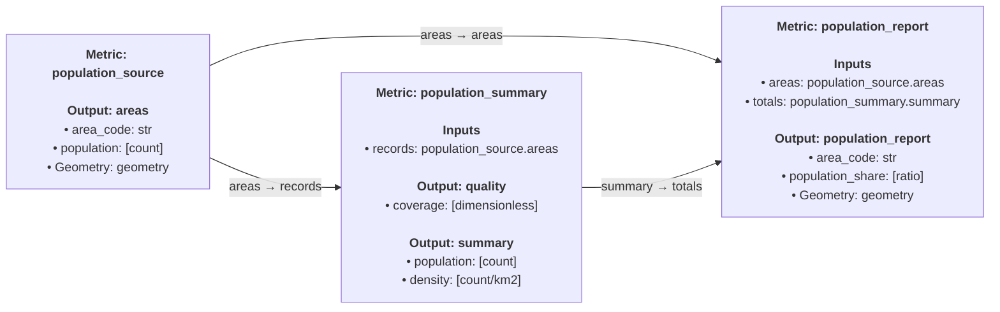

# Detailed diagram preview

```mermaid
flowchart LR
    n0["<b>Metric: population_report</b><br/><br/><b>Inputs</b><br/>#8226;#160;areas:#160;population_source#46;areas<br/>#8226;#160;totals:#160;population_summary#46;summary<br/><br/><b>Output: population_report</b><br/>#8226;#160;area_code:#160;str<br/>#8226;#160;population_share:#160;#91;ratio#93;<br/>#8226;#160;Geometry:#160;geometry"]
    n1["<b>Metric: population_source</b><br/><br/><b>Output: areas</b><br/>#8226;#160;area_code:#160;str<br/>#8226;#160;population:#160;#91;count#93;<br/>#8226;#160;Geometry:#160;geometry"]
    n2["<b>Metric: population_summary</b><br/><br/><b>Inputs</b><br/>#8226;#160;records:#160;population_source#46;areas<br/><br/><b>Output: quality</b><br/>#8226;#160;coverage:#160;#91;dimensionless#93;<br/><br/><b>Output: summary</b><br/>#8226;#160;population:#160;#91;count#93;<br/>#8226;#160;density:#160;#91;count#47;km2#93;"]
    n1 -->|"areas #8594; areas"| n0
    n2 -->|"summary #8594; totals"| n0
    n1 -->|"areas #8594; records"| n2
```
